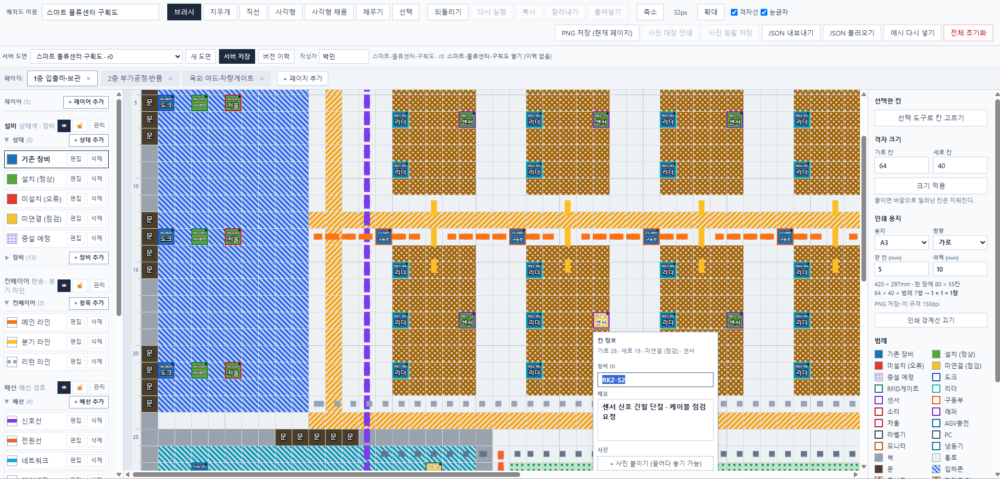
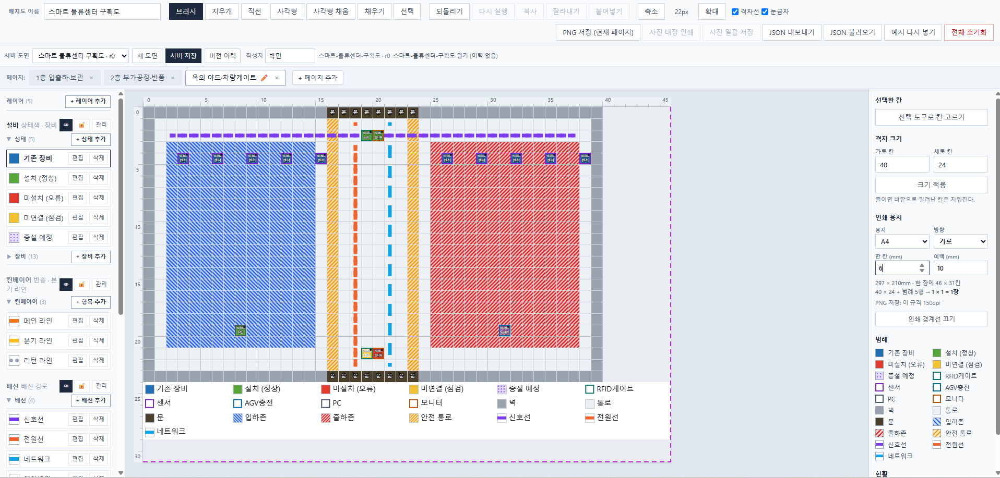
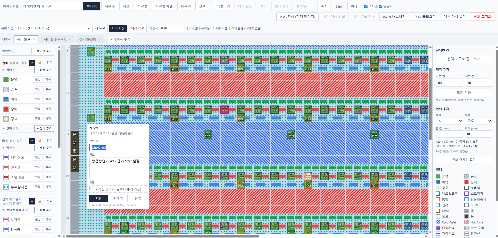

# Grid Tile Editor — 격자형 배치 편집기


도면을 고정 격자(모눈)로 관리하며, **엑셀 셀을 칠하듯** 설비·장비·센서와 배선 경로, 설치/점검 상태를 마우스 드래그로 빠르게 배치하는 웹 기반 배치도 편집기입니다.

공장 설비 배치도뿐 아니라 **좌석 배치 · 창고 구획 · 매장 진열 · 전시 부스** 등 격자로 표현되는 모든 배치 작업에 쓸 수 있습니다.

---

## 📖 Overview

| | |
|---|---|
| **무엇인가** | 브라우저에서 도는 단일 페이지 격자 배치도 편집기 |
| **누가 쓰는가** | 설비 배치도·구획도를 CAD 없이 빠르게 그리고 공유해야 하는 실무자 |
| **왜 격자인가** | 자유 도형 대신 칸 단위로 고정하면 위치가 어긋나지 않고, 좌표(가로 N · 세로 M)로 소통할 수 있습니다 |
| **데이터는 어디에** | 서버(`.grid-projects/`)에 리비전으로 저장. 백업·공유는 JSON, 보고서는 PNG |
| **설치가 필요한가** | 아니오. 정적 파일을 띄우면 그대로 동작합니다 |

### 이런 문제를 풉니다

- CAD는 무겁고, 엑셀은 인쇄하면 어긋나고, 파워포인트는 좌표가 없습니다.
- 도면을 그리는 사람과 읽는 사람이 **"3열 12행 저울 옆"** 처럼 같은 좌표로 말할 수 있어야 합니다.
- 배치도를 A3 두 장에 나눠 인쇄했을 때 **어디서 잘리는지** 그리는 중에 알아야 합니다.

---

## 📚 문서

| 문서 | 내용 |
|---|---|
| 이 README | 소개 · 기능(접힌 소절을 펼쳐 보세요) · 실행 · 단축키 · MCP |
| [docs/server.md](./docs/server.md) | 폴더 공유 · 충돌 · 이력 보관 · HTTP API |
| [docs/data-format.md](./docs/data-format.md) | JSON 형식(`ProjectDoc` v3) · 규칙 |
| [TESTING.md](./TESTING.md) | 자동 테스트와 수동 테스트 시나리오 |

---

## 🖼️ 도면 활용 예시

### 1. 스마트 물류센터 구획도 — 1층 입출하·보관 라인
> 입출하 도크, 팔레트 랙, 컨베이어 반송 라인, RFID 리더 및 센서 점검 메모 팝오버



### 2. 스마트 물류센터 구획도 — 옥외 야드·차량게이트 (다중 페이지 & 인쇄 영역)
> 페이지 탭 전환, 옥외 입·출하존 무늬(빗금·교차빗금), A4 용지 규격 분할 인쇄 경계선 및 범례 띠



### 3. 대형 데이터센터 서버실 배치도
> Cold/Hot Aisle 구획, 서버 랙, PDU, 항온항습기(CRAC), 전력 버스웨이 및 통신 배선



---

## ✨ Key Features

<details>
<summary><b>1. 고정 격자 드래그 편집</b></summary>

| 도구 | 동작 |
|---|---|
| 브러시 | 끌어서 연속 칠하기 |
| 지우개 | 현재 레이어 내용 지우기 |
| 직선 | 시작 칸에서 끝 칸까지 직선 |
| 사각형 | 테두리만 그리기 |
| 사각형 채움 | 영역 전체 칠하기 |
| 채우기 | 이어진 같은 칸 한 번에 (Bucket Fill) |
| 선택 | 범위 드래그 선택 · 식별자 · 메모 편집 |

- **눈금자**: 도면 위·왼쪽에 칸 번호가 붙습니다. 커서가 놓인 행·열이 밝게 표시되어 `가로 37 · 세로 12` 처럼 좌표로 소통할 수 있습니다(`눈금자` 체크박스로 켜고 끕니다).
- **격자 크기**: 가로/세로 각각 10 ~ 200칸 실시간 변경
- **확대/축소**: 14px ~ 32px 5단계. 마우스 휠로도 조절되며 **커서 아래 지점이 제자리에 고정**됩니다
- **화면 이동**: 마우스 **가운데 버튼(휠 클릭)** 드래그. 도구를 바꿀 필요가 없습니다

</details>

<details>
<summary><b>2. 사용자 관리형 팔레트</b></summary>

| 분류 | 표현 | 사용자 편집 |
|---|---|---|
| 배경 (Tile) | 벽 · 통로 · 문 | 고정 항목 |
| 상태 (Status) | 셀 채움 색상 | ✅ 추가·수정·삭제 |
| 장비 (Kind) | 칸에 이름 글자 + 테두리 | ✅ 추가·수정·삭제 |
| 배선 (Wire) | 색상 라인 | ✅ 추가·수정·삭제 |

각 항목은 **색 · 디스플레이 이름 · 설명 · 채움 무늬 · 선 모양**을 가집니다(장비의 선 모양 · 진하기는 항목이 아니라 **칸마다** 정합니다 — 아래).

- **디스플레이 이름** (필수, 24자): 팔레트와 범례에 보이는 이름. **장비는 이 이름이 그대로 도면 칸에 찍히므로** 짧게 두는 편이 읽기 좋습니다(예: `리더`).
- **설명** (선택, 60자): PNG 범례에 이름과 함께 옅은 글씨로 나옵니다(예: `리더 — 식별 리더기`).
- **색**: 추천 프리셋 16색 스와치 + 커스텀 컬러 피커.
- **검증**: 이름 필수, 같은 분류 안에서 중복 이름 금지.

#### 칸 글자

장비 이름과 식별자는 칸 안에 반드시 들어갑니다. 넘칠 것 같으면 순서대로 **글자 크기 줄이기 → 두 줄로 나누기
(한글 네 글자면 두 글자씩) → 가로로 눌러 넣기 → 말줄임(`…`)** 을 씁니다. 글자 둘레 테두리까지 칸 안에서 셉니다.

#### 채움 무늬와 선 모양

색만으로는 구분이 어려운 자리가 있습니다 — 흑백 인쇄, 색각 이상, 비슷한 색이 여럿일 때.
무늬는 색과 별개의 두 번째 표식이라 그런 자리에서도 항목이 구분됩니다.

| | 고를 수 있는 것 | 적용 대상 |
|---|---|---|
| **채움 무늬** | 솔리드 · 빗금 · 역빗금 · 교차빗금 · 점 | 배경 · 상태 (칸을 채우는 분류) |
| **선 모양** | 실선 · 점선 · 파선 | 배선 경로 (장비 테두리는 칸마다) |

무늬는 도면 · 드래그 미리보기 · 팔레트 목록 · 범례 띠 · PNG 범례에서 모두 같은 모양으로 보입니다.
값을 정하지 않은 항목은 예전과 똑같이 솔리드 · 실선으로 그려지고, 저장 파일에도 남지 않습니다.

- **장비 테두리의 선 모양 · 진하기는 칸마다 정합니다.** 장비가 놓인 칸을 고르면 오른쪽 패널 `선택한 칸` 아래 `장비 테두리` 에서 실선 · 점선 · 파선과 진하기(25~100%)를 고릅니다. 누르는 즉시 도면에 먹고 되돌리기 한 번에 되돌아옵니다. 같은 장비라도 칸에 따라 계획(파선 · 옅게)과 설치(실선)를 달리 그릴 수 있고, 진하기는 테두리와 이름 글자에 함께 먹습니다. 잘라내기 · 복사로 옮겨도 칸을 따라가며, `실선` · `100` 을 고르면 기본으로 돌아옵니다. 예전 판에서 장비 항목에 두었던 선 모양 · 진하기는 문서를 열 때 그 장비가 놓인 칸으로 옮겨져 같은 모양으로 보입니다.
- **배선**은 칸을 채우지 않고 지나가므로 채움 무늬가 아니라 **선 모양만** 씁니다. 이어진 방향으로만 띠가 늘어나고, 점선·파선은 이웃 칸과 점 위치가 이어지도록 맞추며, 모퉁이·갈림·끝에는 매듭을 채워 끊겨 보이지 않게 합니다.
- **칸 글자(식별자·이름)** 는 바탕과 반대 명도의 테두리를 두르고 찍습니다. 밝은 색이나 빗금 위에서도 글자가 묻히지 않습니다.

팔레트가 길어지면 분류 제목(`상태` · `장비` · `배선` · `배경`)을 눌러 **접었다 펼 수 있습니다.**
제목 옆에 항목 수가 붙고(`장비 (12)`), 접어 둔 분류에서도 `+ 추가` 버튼과 **지금 고른 항목**은 그대로 보입니다.
접어 둔 상태는 브라우저에 기억해 새로고침해도 유지됩니다.

> **보존 정책** — 도면에 이미 칠해진 항목을 삭제하면 두 갈래를 묻습니다.
> `칸은 그대로 두고 목록에서만 삭제`(정의를 남겨 색이 깨지지 않음) 또는 `배치된 N칸까지 함께 삭제`.
> 팔레트는 **프로젝트 공용**이므로 사용량·삭제 판정·범례는 **모든 페이지를 합쳐** 계산합니다.

</details>

<details>
<summary><b>3. 레이어 관리</b></summary>

`배경` · `설비` · `배선` 3개 레이어를 독립적으로 켜고 끕니다. 배선 전용 도면, 설비 전용 도면을 따로 인쇄할 수 있습니다.

**레이어 추가와 관리** — 왼쪽 패널 맨 위 `+ 레이어 추가` 로 레이어를 직접 만들 수 있습니다(기본 3종 포함 최대 12개).

- **그리는 방식**을 둘 중에 고릅니다. `칸 채움` 은 배경처럼 고른 색으로 칸을 칠하고, `선 잇기` 는 배선처럼 이웃한 칸끼리 선을 잇습니다. 새 레이어에는 그 레이어만의 팔레트 분류가 하나 생기고, 항목을 추가·수정·삭제하는 방식은 기존 분류와 같습니다.
- **표시(👁)** 는 그 레이어를 그리지 않게 합니다. 내용은 그대로 남습니다.
- **잠금(🔒)** 은 칠하기·지우기·채우기·붙여넣기·잘라내기가 그 레이어를 건드리지 못하게 합니다. 아래 깔린 배경을 보호하면서 위 레이어만 손볼 때 씁니다. 잠긴 레이어도 화면에는 그대로 보이고, 복사는 막지 않습니다.
- **관리** 를 누르면 이름 변경, 순서(`▲ 위로` · `▼ 아래로`), `칸 비우기`, `레이어 삭제` 가 펼쳐집니다. 목록에서 위에 있는 레이어가 도면에서도 위에 얹힙니다. 격자선은 채움 레이어 위, 표식 레이어(설비·배선) 아래에 그려집니다.
- **기본 3종(`배경` · `설비` · `배선`)은 지울 수 없습니다.** 칸을 담는 자리가 문서 구조에 박혀 있어, 목록에서 빠지면 이미 그려 둔 칸이 화면에서 사라지기 때문입니다. 이름 변경 · 순서 · 잠금 · 표시 · 비우기는 기본 레이어에도 모두 됩니다.
- **레이어를 몰랐던 이전 판 도면도 그대로 열립니다.** 레이어 목록이 없으면 기본 3종을 넣고, 기본 3종 중 빠진 것이 있으면 되채웁니다.

</details>

<details>
<summary><b>4. 칸별 식별자 · 메모</b></summary>

- **우클릭 즉시 편집**: 어떤 도구를 쓰고 있든 칸에서 오른쪽 버튼을 누르면 `칸 정보` 상자가 열립니다. `Enter` 저장 · `Shift+Enter` 줄바꿈 · `Esc` 닫기. 우클릭한 칸은 칠해지지 않습니다.
- **말풍선 확인**: 메모가 있는 칸에 마우스를 올리면 내용이 뜹니다. 도면 가장자리에서는 방향을 안쪽으로 바꿔 잘리지 않습니다.
- **사진 첨부**: 칸마다 현장 사진을 최대 8장까지 걸어 둘 수 있습니다. 파일 선택으로 여러 장을 한 번에 고르거나 상자에 끌어다 놓으면 되고, 붙이는 순간 **720p 급**(짧은 변 720px · 긴 변 최대 1280px)으로 줄여 WebP(브라우저가 WebP 를 못 만들면 JPEG)로 담습니다 — 라벨·명판의 글자가 읽힐 만큼은 남기고, 한 장 한도(약 600KB)를 넘는 사진만 품질·크기를 한 단계씩 더 줄입니다. 사진이 있는 칸은 왼쪽 아래에 작은 네모 표시가 붙고(두 장 이상이면 장수도 함께), 마우스를 올리면 첫 장 미리보기와 나머지 썸네일이 뜹니다. 사진 한 장만 담던 이전 판 도면도 그대로 열립니다 — 열 때 목록으로 옮겨집니다.
- **사진 대장**: 도면에 흩어져 있는 사진을 한 장으로 모아 인쇄하거나 파일로 내려받습니다.
    - `사진 대장 인쇄` — 프로젝트 전체 사진을 좌표 · 식별자 · 메모와 함께 A4 세로 3열 격자로 모아 새 창에 띄우고 브라우저 인쇄를 엽니다. 페이지가 여럿이면 페이지 이름으로 갈라 적고, 사진과 그 설명이 장 경계에서 갈리지 않습니다.
    - `사진 일괄 저장` — 붙어 있는 사진을 `1층-메인-공장_5_3_C1101_photo_2.jpg` 처럼 페이지 · 세로 · 가로 · 식별자 · 순번이 담긴 이름으로 낱장 저장합니다.
    - 칸 정보 상자에서는 썸네일마다 `↓` 로 그 한 장만 저장하고, `이 칸 사진 인쇄` 로 그 칸의 식별자 · 메모 · 사진만 모아 인쇄합니다. 저장하기 전의 사진도 그대로 뽑힙니다.
- **사진 확대 보기**: 칸 정보 상자의 썸네일을 누르면 화면 전체에 원본 비율(`object-contain`)로 크게 띄웁니다. 여러 장이면 `◀` · `▶` 또는 키보드 `←` · `→` 로 넘기고 끝에서 끝으로 돕니다. 위쪽에 식별자 · 페이지 · 칸 자리와 `2 / 5` 순번, 파일 크기가 함께 적히고, 그 자리에서 `↓` 로 저장할 수 있습니다. 닫기는 `×` · `Esc` · 바깥 배경 클릭입니다(확대 보기가 열려 있는 동안 `Esc` 는 칸 정보 상자를 닫지 않습니다).
- **영상 첨부**: 사진과 같은 자리(칸 정보 상자)에 현장 영상을 칸마다 최대 3편까지 붙입니다. 파일 선택이나 끌어다 놓기로 넣고(사진 자리에 영상을 놓아도 제 자리로 갑니다), 한 편 한도(약 12MB)를 넘는 영상은 붙이는 순간 브라우저 안에서 **480p 급 · WebM** 으로 다시 굽습니다 — 실시간으로 도는 작업이라 영상 길이만큼 걸리고 진행(`0:12 / 0:45`)이 단추에 표시됩니다. 그래서 영상 길이는 1분 30초 안으로 제한합니다. 다시 굽기를 못하는 브라우저(Safari 등)에서는 한도 안의 MP4 · WebM · MOV 파일만 받습니다. 영상이 있는 칸은 왼쪽 아래 사진 네모 옆에 남색 재생 표시(▶)가 붙고(두 편 이상이면 편수도), 마우스를 올린 말풍선에는 편수만 적힙니다(영상은 무거워 미리 그리지 않습니다). 썸네일을 누르면 화면 전체에서 재생하고 `↓` 로 `{페이지}_{세로}_{가로}_{식별자}_video_{순번}.webm` 이름으로 저장합니다. 사진 대장 인쇄에는 들어가지 않습니다.
- 메모가 있는 칸은 오른쪽 위에 점 지표가 붙습니다.
- 메모는 **칸마다 · 페이지마다** 따로 저장됩니다(팔레트 항목의 `설명`과는 별개).

</details>

<details>
<summary><b>5. 범위 선택과 클립보드</b></summary>

`선택` 도구로 직사각형 범위를 지정하면 배경·설비(상태·장비·ID·메모)·배선이 **상대 위치를 유지한 채** 복사/잘라내기/붙여넣기 됩니다. 붙여넣은 영역은 자동으로 선택 범위가 되고, 되돌리기 한 번으로 원복됩니다.

잘라내서 붙이면 그 칸을 가리키던 **연결도 함께 옮겨집니다** — 장치가 놓인 칸은 장치 연결이 따라가고, 장치 없는 칸끼리 그은 연결(칸 끝점)도 새 자리로 바뀝니다(다른 페이지에 붙여도 그 페이지를 가리킵니다). 복사해서 붙이거나 같은 클립보드를 두 번째 붙일 때는 연결을 옮기지 않습니다.

</details>

<details>
<summary><b>6. 다중 페이지</b></summary>

- 페이지 추가 · 이름 변경(더블클릭 또는 ✏️) · 삭제 · 전환
- 페이지마다 **격자 크기 · 셀 · 메모 · 인쇄 용지 설정**이 완전히 독립
- 팔레트만 프로젝트 공용
- 최소 1개 페이지는 보장(마지막 페이지 삭제 버튼 비활성)

</details>

<details>
<summary><b>7. 인쇄 용지 경계선</b></summary>

툴바 둘째 줄 왼쪽의 `인쇄 용지` 를 켜면 PNG 가 용지 규격으로 나오고, 도면 위에 **자홍색 점선으로 인쇄 경계**가 표시됩니다(`인쇄 경계선 보기` 로 화면 표시만 끌 수 있습니다 — PNG 는 그대로 용지 규격). 용지(A4 · A3 · A2 · Letter), 방향, **인쇄물에서 한 칸이 차지할 길이(mm)**, 여백은 `용지 설정` 단추가 여는 모달에서 정합니다. `메모 본문 인쇄` 와 메모 자리 콤보(빈 곳에 채움 · 별지)도 같은 줄에 있고, 꺼져 있으면 비활성으로 보입니다. 격자 크기는 페이지 줄의 `페이지 추가` 오른쪽에서 고칩니다.

- 몇 장에 걸쳐 어디서 잘리는지 그리는 중에 바로 보입니다 (`가로 3 · 세로 3 = 9장`).
- **범례도 경계 안에 함께** 그려집니다. 인쇄물에는 도면 아래로 범례가 실리므로 장수 계산에도 범례 행이 포함됩니다. 범례 띠는 **격자 너비만큼만** 차지합니다 — 가로 용지에서 격자 오른쪽에 남는 자리는 메모가 위에서 아래까지 씁니다(좁은 격자는 범례 열이 줄어 띠가 조금 두꺼워집니다). 띠가 마지막 장에 남은 행에 안 들어가면 **항목 폭(45→38→32mm), 그다음 줄 높이(6→5mm)를 줄여** 한 장에 맞춥니다. 여유가 있으면 원래 크기고, 줄여도 안 들어가면 원래 크기로 다음 장에 넘깁니다.
- 격자가 한 장보다 작으면 **용지 크기만큼 화면이 넓어지고** 격자 밖은 회색으로 칠해집니다.
- 용지 설정은 **페이지마다 따로**입니다. 1공장은 A3 가로, 2공장은 A4 세로처럼 섞어 쓸 수 있습니다.
- 격자 칸 수는 **바뀌지 않습니다**. 자홍색 점선 자체는 화면 표시 전용이라 인쇄물에 찍히지 않습니다.
- **PNG 저장이 이 용지 규격을 그대로 따릅니다** — 아래 참고.

</details>

<details>
<summary><b>8. 이력 · 저장 · 내보내기</b></summary>

- **Undo / Redo**: 최대 60단계. 페이지 전환은 이력에 들어가지 않고, 페이지 추가·이름변경·삭제는 되돌릴 수 있습니다.
- **저장은 서버 한 곳**: 도면을 브라우저에 저장하지 않습니다. `서버 저장` 이 유일한 저장이고, 첫 화면에서는 서버의 가장 최근 도면을 자동으로 엽니다. 서버가 없는 자리에서는 편집한 내용이 새로고침과 함께 사라지므로 `JSON 내보내기` 로 남겨 두십시오.
    - 두 곳에 저장하지 않는 이유: 브라우저에서 고친 것과 옆자리 사람이 서버에 올린 것 중 어느 쪽이 최신인지 아무도 알 수 없게 되고, 첫 화면에 무엇을 띄울지부터 답이 없어집니다.
- **JSON 저장/불러오기**: 모든 페이지 + 공용 팔레트를 통째로 백업·공유.
- **범례**: **그 페이지에서 실제로 칠한 항목만** 담습니다. 팔레트에만 있고 쓰지 않은 항목은 범례를 차지하지 않습니다(인쇄 자리도 그만큼 아낍니다). 편집기 오른쪽 패널에는 범례를 두지 않습니다 — 인쇄 경계선을 켠 도면 아래 띠, PNG, 휴대폰 화면(`/m`)에서 봅니다.
- **워터마크**: PNG 아래에 `제목 · r리비전 · 출력시각 · 작성자` 를 옅게 적습니다. 현장에 돌아다니는 종이가 어느 판인지 구분됩니다.
- **PNG 내보내기**: 현재 페이지 이미지. 용지 설정 여부에 따라 두 가지로 나옵니다.
  - **용지 설정이 없을 때**: 제목 + 도면 + 범례를 격자 크기에 맞춰 한 장으로.
  - **용지 설정이 있을 때**: 용지 규격에 정확히 맞춘 인쇄용 이미지.
- **전체 초기화**: 확인 창을 거쳐 칸만 비웁니다. **팔레트 정의는 지워지지 않습니다.**

</details>

<details>
<summary><b>9. 장치 대장 (Device Registry)</b></summary>

리더기 · 저울 · PLC 같은 **실물 장치의 명세(S/N · IP · MAC · COM 포트 · PORT)를 도면 칸과 분리해** 프로젝트 한 곳에서 관리합니다. 칸은 장치를 `deviceId` 로 참조만 하므로, 도면에 아직 안 놓은 장치(예비품 · 인식 불가)도 대장에 남고 칸을 옮겨도 장치 정보가 따라갑니다.

#### 한 곳이 원본입니다

- **연결된 칸의 글자 = 장치의 H/W S/N.** 대장에서 S/N 을 고치면 그 장치가 놓인 모든 페이지의 칸 글자가 따라 바뀝니다.
- 연결을 풀거나(해제) 대장에서 지우면 칸의 S/N 글자도 함께 지워집니다 — 대장에 없는 S/N 이 도면에 남지 않습니다. 칠해 둔 상태·장비 모양과 메모는 남습니다.
- 그래서 연결된 칸에서는 식별자 입력이 접히고, 명세는 장치 대장에서만 고칩니다.

#### 장치 한 대가 담는 것

`장치 종류`(RFID 리더기 · 저울 · PLC …) · `프로그램`(예: C1101) · `작업장 번호` · `구분`(입하 · 08 출고 …) · `H/W S/N` · `IP` · `MAC` · `COM 포트 연결`(체크) · `PORT` · `비고`. 모두 선택 항목이고 최대 60자입니다.

#### 쓰는 법

- **등록 · 연결**: 칸을 우클릭 → 연결 안 된 칸이면 `장치 연결…`(기존 장치 고르기) 또는 `새 장치로 등록`(칸의 식별자가 S/N 으로 옮겨집니다).
- **수정**: 연결된 칸을 우클릭 → `연결된 장치` 블록을 누르면 대장 모달이 그 장치를 펼친 채 열립니다.
- **목록**: 툴바의 `장치 대장 (N대)` — 작업장 → 구분 순 표, 아무 필드나 걸리는 검색, 미배치 수 표시.
    - `위치로` — 그 장치가 놓인 칸으로 이동(페이지 전환 + 선택). 위치는 `1번방 (4, 14)` 처럼 적습니다.
    - `배치` — 미배치 장치를 들고 도면에서 놓을 칸을 클릭합니다. `Esc` 로 취소.
    - `해제` — 놓인 모든 칸에서 연결과 S/N 글자를 지우고 미배치로 되돌립니다.
    - `새 장치` — 도면 없이 대장에만 올립니다(미배치).
- **내보내기**: `CSV 저장`(엑셀용, BOM 포함) · `마크다운 저장`(문서용 표). 화면 목록과 같은 순서·같은 위치 글이 실립니다.
- 장치 편집 · 삭제 · 배치 · 해제 모두 `Ctrl+Z` 로 되돌릴 수 있습니다.

</details>

<details>
<summary><b>10. 키보드 단축키</b></summary>

| 키 | 동작 | 비고 |
|---|---|---|
| `Ctrl + Z` | 되돌리기 | 최대 60단계 |
| `Ctrl + Y` / `Ctrl + Shift + Z` | 다시 실행 | |
| `Ctrl + C` | 선택 범위 복사 | `선택` 도구 사용 시 |
| `Ctrl + X` | 선택 범위 잘라내기 | |
| `Ctrl + V` | 붙여넣기 | 클릭한 칸이 원점 |
| `우클릭` | 칸 정보(식별자 · 메모) 편집 | 도구 무관, 칸은 칠해지지 않음 |
| `Enter` | 칸 정보 저장 / 페이지 이름 확정 | |
| `Shift + Enter` | 메모 줄바꿈 | |
| `Esc` | 편집 상자 닫기 / 취소 | |
| `휠` | 확대 · 축소 | 커서 아래 지점 고정 |
| `가운데 버튼 드래그` | 화면 이동 | |

> macOS에서는 `Ctrl` 대신 `⌘`도 동작합니다. 텍스트 입력창에 커서가 있는 동안에는 `Ctrl+C/X/V`를 가로채지 않습니다.

</details>

---

## 👥 로컬 폴더 공유와 버전 이력

같은 폴더(`.grid-projects/`)를 여러 사람이 함께 쓰는 가벼운 공유 방식입니다. 계정도 데이터베이스도 없습니다.
저장할 때마다 리비전이 남고, 남이 먼저 저장했으면 덮어쓰기 · 사본 · 서버 것 열기 중에서 고릅니다.

→ 화면 · 충돌 처리 · 폴더 구조 · 이력 보관 규칙 · HTTP API 는 **[docs/server.md](./docs/server.md)**.

---

## 📱 모바일 도면 보기 (`/m`)

현장에서 휴대폰으로 도면을 **읽기만** 하는 화면입니다. 편집기(`/`)는 책상 화면과 마우스를 전제로 하므로, 서버에 저장된 도면을 손가락으로 보는 길을 따로 둡니다. 3100 상시 서비스에서 `http://<서버 주소>:3100/m` 으로 엽니다.

- **목록** — 서버 폴더(`.grid-projects`)의 도면을 제목 · 페이지 수 · 리비전 · 작성자 · 저장 시각과 함께 보여 줍니다. 누르면 열립니다.
- **손가락** — 한 손가락으로 옮기고, 두 손가락으로 키우고 줄입니다. 두 번 두드리면 그 자리를 3배로 키우고, 다시 두드리면 전체가 보이게 돌아옵니다(아래 `전체 보기` 도 같습니다).
- **칸 누르기** — 그 칸에 있는 것을 아래 시트로 읽습니다: 구역 · 장비 ID · 칠해진 팔레트 항목(레이어 이름과 함께) · 장치 대장 명세 · 메모 · 사진(누르면 크게).
- **범례 · 메모** — 아래 단추로 이 페이지의 범례와 번호 매긴 메모 목록을 엽니다. 메모를 누르면 그 칸으로 건너가 표시합니다. 번호는 인쇄물과 같습니다.
- **페이지** — 여러 페이지면 위에 칩으로 늘어섭니다.
- **주소** — `/m?id=<도면 id>&page=<페이지 id>` 로 특정 도면·페이지를 바로 열 수 있어 링크를 나눠 줄 수 있습니다. 뒤로 가기는 목록으로 돌아옵니다.
- **자동 갱신** — 열어 둔 도면은 30초마다 서버 리비전을 확인해, 바뀌었으면 조용히 갈아 끼우고 알립니다. 벽에 걸어 둔 태블릿이 최신 판을 따라옵니다. `↻` 로 바로 읽을 수도 있습니다.
- 저장 · 편집 단추는 없습니다. 브라우저 확대는 꺼 두어 두 손가락이 도면만 키웁니다.

---

## 📡 실시간 현황판 (`/live`)

도면 위에 **RFID 리더의 지금 상태**를 얹어 보이는 벽걸이용 화면입니다. [RfidReaderMonitor](https://github.com/SYacuCLoud/RfidReaderMonitor) 가 MQTT 브로커로 발행하는 리더 상태를 브라우저가 WebSocket 으로 직접 구독합니다. 도면 문서는 한 글자도 바꾸지 않습니다 — 이벤트가 리비전을 만들면 이력이 초 단위로 쌓이고 사람 편집과 부딪치기 때문에, 받은 값은 화면 안에만 두고 오버레이로 그립니다.

- **연결** — 기본 브로커는 도면 서버와 같은 PC 의 `ws://<서버 주소>:9001` 입니다. 구독은 `rfid/+/reader/+/state` · `…/event` · `rfid/+/host/+/status`. 주소에 `?broker=ws://…:9001&site=<사업장>&prefix=<첫 마디>` 로 바꿉니다.
- **칸과 리더 잇기** — 편집기의 **장치 대장 S/N** 이 리더의 S/N 과 같으면 그 장치가 놓인 칸입니다(여러 칸이면 모두). 대장을 안 쓰는 도면은 칸 식별자가 S/N 이나 별명과 같아도 잇습니다. 자리가 없는 리더는 오른쪽 **미배치 리더** 에 나열되어 대장 등록을 유도합니다.
- **표시** — 태그가 놓인 칸은 녹색으로 채우고 UID 끝 6자리를 적습니다. 비어 있는 칸은 파란 테두리, 감시 PC 가 끊긴 리더는 회색 점선입니다. 등장 · 제거 순간에는 칸 둘레로 초록 · 주황 테가 퍼지며 사라집니다. 리더별 현재 상태가 retained 로 오므로 화면을 늦게 켜도 접속 즉시 모든 칸이 채워집니다.
- **잔상** — 태그를 들어낸 칸에는 **마지막에 있던 태그**가 회색 반투명 글자로 기본 20분 남고, 리더 목록에도 `마지막 통번호 129 · 12분 전` 이 붙습니다. 다음 태그가 오면 사라집니다. 주소의 `&ghost=분` 으로 바꾸고 `ghost=0` 이면 끕니다. 화면을 늦게 켜면 첫 제거를 본 뒤부터 쌓입니다 — 발행 쪽이 상태에 선택 필드 `lastUid` · `lastTime` 을 실어 주면 즉시 채워집니다.
- **오른쪽 패널** — 태그 감지 · 배치된 리더 · 오프라인 수, 감시 PC 별 online/offline(브로커 유언으로 끊김을 바로 안다) 과 오늘 건수, 리더 목록, 최근 이벤트(등장 · 제거 · 체류 시간).
- **도면 따라오기** — 30초마다 서버 리비전을 확인해 편집기에서 리더를 옮기면 현황판도 옮깁니다. 페이지가 여럿이면 위 칩으로 고릅니다.
- **주소** — `/live?id=<도면 id>&page=<페이지 id>` 를 벽걸이 PC 의 즐겨찾기에 둡니다. 편집기 도구 막대의 `실시간 현황판 ↗` 이 지금 열린 도면 · 페이지의 이 주소를 새 탭으로 엽니다.
- mqtt.js 는 번들에 넣지 않고 `public/vendor/mqtt.min.js` 를 브라우저에서 늦게 읽습니다(사내망에서도 돌아야 하니 CDN 은 쓰지 않습니다). 판을 올리려면 `npm run vendor:mqtt`.

### MQTT 메시지 형식 (v1)

형식의 원본과 JSON Schema 는 발행 쪽인 [RfidReaderMonitor `docs/mqtt/`](https://github.com/SYacuCLoud/RfidReaderMonitor/tree/main/docs/mqtt) 에 있습니다. 현황판은 아래 필드만 읽고 **모르는 필드는 무시**하며, 없는 필드는 빈 값으로 칩니다. 다른 발행자(PLC 게이트웨이, Node-RED 등)도 이 필드만 채우면 현황판에 붙습니다.

| 토픽 | 현황판이 쓰는 필드 |
|---|---|
| `{prefix}/{site}/reader/{key}/state` (retained) | `serial` 로 장치 대장을 찾고(없으면 토픽의 `{key}`), `present` · `online` 으로 칸 색, `uid` 를 칸에 적음, `reader`(없으면 `alias` → `readerName`) · `host` · `state` · `time` 은 오른쪽 목록에 표시. 빈 페이로드는 그 리더를 지운 것 |
| `{prefix}/{site}/reader/{key}/event` | `kind`(`APPEAR` / `REMOVE`) 로 잔상 색, `time` · `reader` · `uid` · `dwellMs`(REMOVE) 를 최근 이벤트에. `time` + 토픽 + `kind` 가 같으면 재전송으로 보고 한 번만 |
| `{prefix}/{site}/host/{host}/status` (retained + LWT) | `online` 으로 감시 PC 점 색, `time` · `readerCount` · `onlineReaders` · `appearToday` · `removeToday` 를 타일에 |

```json
{"v":1,"type":"state","time":"2026-09-14T15:32:32.931+09:00","host":"PC-LINE1","reader":"1번 저울","alias":"1번 저울","readerName":"ACS ACR1552 1S CL Reader PICC 0","serial":"RR657-005592","present":true,"online":true,"uid":"E0040150ABCDEF01","tech":"ISO 15693","state":"PRESENT"}
{"v":1,"type":"event","time":"2026-09-14T15:32:40.000+09:00","kind":"REMOVE","reader":"1번 저울","serial":"RR657-005592","uid":"E0040150ABCDEF01","dwellMs":7069,"host":"PC-LINE1"}
{"v":1,"type":"status","online":true,"host":"PC-LINE1","time":"2026-09-14T15:32:33.931+09:00","version":"0.4.0","readerCount":2,"onlineReaders":2,"presentReaders":1,"appearToday":5,"removeToday":4}
```

`time` 은 ISO 8601(밀리초 · 시간대 오프셋 포함), `uid` 는 16진 대문자입니다. 토픽 첫 마디 `prefix` 는 무엇이든 받고(구독 필터가 이미 고른 뒤라 따지지 않습니다), `{key}` 는 발행 쪽이 리더 S/N → 별명 → 이름 순으로 채운 값입니다. 해석 코드는 [app/live/liveState.ts](./app/live/liveState.ts) 이고 `tests/live-state.test.mjs` 가 지킵니다.

### 기준정보 매핑 — UID 를 실물 이름으로

리더는 UID 만 줍니다. 그것이 어느 통(桶)인지, 누구의 사원증인지는 회사 기준정보(대개 SQL Server 의 표)에 이미 있으므로, 현황판은 **그 표의 열과 열을 짝짓는 설정**만 받아 UID 대신 이름을 보입니다. 별도의 태그 대장을 만들지 않습니다 — 원본은 한 곳(회사 DB)이어야 합니다.

- **동작** — 도면 서버가 설정에 적힌 표를 **주기적으로 통째로 읽어** 메모리에 들고(`/api/lookup`), 브라우저는 그 스냅샷 하나로 UID 를 찾습니다. 이벤트마다 DB 에 묻지 않으므로 DB 가 멀거나 잠깐 끊겨도 마지막 스냅샷으로 계속 돕니다. 오른쪽 패널 **기준정보** 칸에 행 수 · 마지막 읽은 시각 · 오류 · `새로고침` 이 있습니다.
- **표시** — 태그가 놓인 칸에는 UID 끝자리 대신 실물 이름(`통번호 129`)이 적히고, 폭에 안 들어가면 글자를 줄이다가 UID 로 물러납니다. 리더 목록에는 `통번호 129 · 칼작업분배`, 최근 이벤트에도 이름이 붙습니다. 기준정보에 없는 UID 는 `미등록 태그` 로 표시됩니다.
- **두 층으로 나뉩니다.** 접속(어느 DB, 어떤 계정)은 관리자가 서버 파일로, 매핑(어느 표의 어느 열, 무엇을 이름으로, 몇 분마다)은 사용자가 화면에서 정합니다. 비밀번호와 자유 SQL 은 브라우저에 절대 나가지 않습니다.
- **인증은 없습니다.** 편집기 전체가 사내망 신뢰 모델이라 설정 창과 `/api/lookup` · `/api/live` 도 같은 망의 누구나 쓸 수 있습니다. 저장자 이름과 시각만 파일에 남습니다. 인터넷에 직접 열어 두지 마십시오.
- **설정 화면** — 기준정보 칸의 `설정`(설정이 없으면 `설정 만들기`). 접속 이름을 고르면 그 DB 의 **표 목록**이, 표를 고르면 **열 목록**이 뜹니다(INFORMATION_SCHEMA). UID 열과 형식(16진수 · 바이트 역순), 칸에 적을 제목 · 부제 템플릿(`{열이름}` — `열 넣기…` 로 조립), 상세에 보일 열과 표시 이름, 조건(`열 · 연산자 · 값`, 모두 AND), **다시 읽는 주기(초)** 를 정하고 `미리보기` 로 5행을 실제 값으로 본 뒤 `저장하고 바로 읽기`. 저장자 이름과 시각이 함께 남습니다.
- **접속 파일(관리자)** — `.grid-projects/.lookup/connections.json`. 이름 → env 파일(`_env` 규칙: `SERVER` · `DATABASE` · `USERNAME` · `PASSWORD`). 예시는 [docs/lookup.connections.example.json](./docs/lookup.connections.example.json). 계정은 그 표 **SELECT 권한만** 있으면 됩니다 — 이 기능은 쓰기가 없습니다.
- **매핑 파일** — `.grid-projects/.lookup/{사업장}.json` (사업장 = MQTT 토픽의 `{site}`, 보통 `default`). 설정 화면이 쓰는 파일이고 손으로 고쳐도 다음 갱신(또는 `새로고침`)에 반영됩니다. 예시는 [docs/lookup.example.json](./docs/lookup.example.json).

```json
{
  "v": 1,
  "source": { "kind": "mssql", "connection": "MES", "table": "dbo.tb_rfid_card", "filters": [{ "column": "사용여부", "op": "ne", "value": "0" }] },
  "key": { "column": "카드번호", "format": "hex" },
  "display": { "title": "{정의구분} {정의번호}", "subtitle": "{정의명}" },
  "columns": [ { "column": "정의구분", "label": "구분" }, "정의번호", "정의명", { "column": "등록일자", "label": "등록일" } ],
  "refreshSeconds": 300
}
```

- `key.field` 는 MQTT 메시지 쪽 필드입니다. 기본 `uid`(태그 UID, 태그가 놓여 있을 때만 이름이 붙음). `serial` 로 바꾸면 리더 S/N 으로 **리더 대장**을 잇고 태그가 없어도 리더에 이름이 붙습니다. `reader` · `alias` · `readerName` · `key` · `host` · `tech` 도 되고, 다른 발행자의 필드 이름(`epc` 등)은 직접 적습니다.
- `key.format` 이 `hex` 면 리더의 `C6 11 7A …` 와 DB 의 `c6117a…` 를 16진수만 남겨 대문자로 맞춰 비교합니다. DB 가 바이트를 거꾸로 저장했다면 `"reverseBytes": true`. 문자 키(카드 번호 문자열)는 `"text"`.
- `display.title` · `subtitle` 은 `{열이름}` 자리표시 템플릿입니다. 제목이 쓰는 열은 `columns` 에 없어도 읽습니다. `columns` 는 스냅샷에 실어 상세(툴팁)에 보일 열 — 여기 적지 않은 열은 서버 밖으로 나가지 않습니다.
- 조건 연산자는 `eq`(=) · `ne`(≠, NULL 포함) · `contains`(LIKE) · `empty` · `notEmpty` 입니다. 값은 리터럴로만 들어가고 식별자는 대괄호로 감싸므로 표 · 열 이름에 대괄호 · 공백 · 따옴표는 쓸 수 없습니다. 그 이상의 조건이 필요하면 관리자가 파일에 `source.where`(자유 SQL, 화면에는 있다는 사실만 보임)를 적거나 DB 에 뷰를 만듭니다.
- 접속 이름 없이 `source.env` 로 env 파일을 직접 가리키는 구식 설정도 그대로 읽습니다. 화면에서 접속 이름을 고르면 그쪽으로 바뀝니다.
- 지금은 `mssql` 소스만 있습니다. 순수 계산은 [app/live/lookup.ts](./app/live/lookup.ts), DB 읽기 · 접속은 `server/lookupStore.ts`, 경로 규칙은 `server/lookupRouter.ts`, 화면은 `app/live/LookupSettings.tsx`, `tests/lookup.test.mjs` 가 지킵니다.

### 메시지 형식 프로필 — 다른 발행자의 페이로드 받기

위 "MQTT 메시지 형식 (v1)" 은 RfidReaderMonitor 가 내는 모양입니다. PLC 게이트웨이 · Node-RED 처럼 `{"tag":{"epc":"…"},"detected":"ON","ts":1789443082}` 식으로 다르게 내는 발행자는 **형식 프로필**로 맞춥니다. 토픽 구조(`{prefix}/{site}/reader/{key}/state` 등)는 그대로여야 합니다 — 구독 필터와 칸 잇기 규칙이 거기 걸려 있습니다.

- **화면** — 머리줄 접속 표시 옆 `형식 v1`(또는 `형식 사용자 정의`). 상태 · 이벤트 · PC 상태 세 탭에 현황판이 쓰는 필드 목록이 있고, 필드마다 **JSON 경로**(`tag.epc`, `readers[0].id`)를 적습니다. 오른쪽에 그 사업장에서 **마지막에 실제로 받은 메시지 원문**이 떠 있고, 경로를 고치면 표에서 "표본에서 읽은 값" 이 바로 바뀝니다(표본에 없는 경로는 노랗게). 아래에 값 해석 — 참으로 볼 글자 값(`ON`, `1` …), 제거로 볼 kind 값(`OUT` …), 시각 해석(자동 · ISO · epoch ms · epoch s). `저장하고 다시 읽기` 를 누르면 브로커에 다시 붙어 retained 를 새 프로필로 읽습니다. `기본값(v1)으로` 되돌리면 파일이 지워집니다.
- **파일** — `.grid-projects/.live/{사업장}.json`. 없는 사업장은 v1 입니다. 안 적은 필드는 v1 경로(= 필드 이름), 빈 경로는 "읽지 않음" 입니다.
- **규칙** — `present` · `online` 은 불리언 · 숫자를 그대로, 글자는 참 목록에 있을 때만 참. `online` 경로가 표본에 없으면 살아 있는 것으로 봅니다. `kind` 는 제거 목록에 있으면 제거, 아니면 등장. `time` 이 숫자면 epoch(자동은 크기로 ms/s 판단), 글자면 그대로. `dwellMs` 는 숫자 글자도 받습니다.
- 순수 계산은 [app/live/messageFormat.ts](./app/live/messageFormat.ts)(경로 · 값 해석 · 미리보기), 메시지 반영은 `app/live/liveState.ts` 의 `applyMessage(…, book)`, 파일은 `server/formatStore.ts`, 화면은 `app/live/FormatSettings.tsx`, `tests/message-format.test.mjs` 가 지킵니다.

---

## 🖨️ 용지 규격에 맞춘 PNG

`인쇄 용지`를 정해 두면 **용지가 먼저**입니다. 이미지 크기가 곧 용지 크기입니다.

| | |
|---|---|
| **이미지 크기** | 용지 mm를 DPI로 바꾼 픽셀 (A4 세로 · 150dpi → 1240 × 1754px) |
| **여백 · 한 칸** | `여백(mm)` · `한 칸(mm)`을 같은 자로 재서 그립니다 |
| **장 나누기** | 화면 경계선과 **같은 계산**(장당 칸 수 · 범례 띠)으로 나눕니다 |
| **여러 장** | 장마다 파일 하나. `…-A4-세로-150dpi-2of4.png` |
| **범례** | 도면 아래 띠에 함께 실립니다 (화면 미리보기와 같은 자리) |
| **워터마크** | 여백이 6mm 이상이면 아래 여백에 `제목 · r리비전 · 3/8 (가로 3 · 세로 1) · 출력시각 · 작성자` 한 줄 |

뽑은 PNG를 **100% 배율로 인쇄하면** 화면에서 보던 경계선 안내와 장수·자리가 맞습니다.
인쇄 경계선(자홍색 점선)은 화면 안내 전용이라 이미지에는 들어가지 않습니다 — 장이 나뉜 자리가 곧 경계입니다.

---

## 🧱 Tech Stack

| 영역 | 사용 기술 |
|---|---|
| UI | React 19 (RSC), TypeScript 5.9 (strict) |
| 프레임워크 | [vinext](https://www.npmjs.com/package/vinext) (App Router 호환) + Vite 8 |
| 스타일 | Tailwind CSS 4 |
| 렌더링 | HTML5 Canvas 2D (격자·배선·PNG 시트 직접 렌더) |
| 배포 대상 | Cloudflare Workers (`@cloudflare/vite-plugin`, Wrangler) |
| 저장소 | 브라우저 `localStorage` · 로컬 폴더 공유(`.grid-projects/`) (선택적으로 Cloudflare D1 + Drizzle ORM) |
| 에이전트 연동 | `@modelcontextprotocol/sdk` 1.30 + zod 4 (stdio MCP 서버) |
| 테스트 | `node --test` + `tsx --test` |

> 편집기 자체는 **서버가 필요 없습니다.** Worker / D1 구성은 정적 호스팅과 향후 서버 저장을 위한 발판입니다.

---

## 🚀 Quick Start

### 요구 사항

- Node.js **22.13 이상**

### 개발 서버 (테스트용 · 포트 3200)

```bash
npm install     # 처음 1회
npm run dev
```

브라우저에서 `http://localhost:3200` 으로 접속합니다. 개발 서버는 **3200** 에 뜨므로 아래 상시 서비스(3100)와 나란히 돌릴 수 있습니다.

### 프로덕션 빌드

```bash
npm run build
```

- 빌드 산출물: **`Grid.Tile.Editor/dist/`** (`dist/client` 정적 자산, `dist/server` Worker 번들)
- 빌드 결과를 로컬에서 확인: `npm run start:test` (포트 3200 · 3100 상시 서비스와 겹치지 않음)

### 상시 서비스 (포트 3100)

`http://localhost:3100` 에서 늘 떠 있는 서버입니다. 작업 폴더의 `dist/` 가 아니라 **`.serve/dist/` 스냅샷**을 서비스하므로, `npm run build` · `npm test` 가 `dist/` 를 다시 써도 3100 은 영향을 받지 않습니다. 3100 에 새 빌드를 올리는 것은 `deploy` 한 번입니다.

```bash
scripts\service.cmd install    # 처음 1회: 로그온 시 자동 시작 등록 + 지금 시작
npm run deploy                 # 빌드 → .serve\dist 스냅샷 → 재시작 (= scripts\service.cmd deploy)
scripts\service.cmd status     # 서버 · 데몬 · 자동 시작 · 스냅샷 시각
scripts\service.cmd log        # logs\server.log 마지막 30줄
scripts\service.cmd stop       # 중지 (start 로 다시 시작)
scripts\service.cmd uninstall  # 자동 시작 해제 + 중지
```

- 자동 시작은 작업 스케줄러(`Grid Tile Editor` 작업) 등록을 먼저 시도하고, 권한이 없으면(일반 사용자) 시작 프로그램 폴더(`shell:startup`)에 `Grid Tile Editor.vbs` 를 둡니다. `uninstall` 이 둘 다 지웁니다.
- 데몬(`scripts/server-daemon.cmd`)이 숨은 창에서 돌며 node 가 죽으면 5초 뒤 다시 띄웁니다. 로그는 `logs/server.log` (5MB 를 넘으면 `.1` 로 교대).
- 공유 도면 폴더는 그대로 프로젝트의 `.grid-projects/` 입니다(데몬이 `GRID_TILE_DATA_DIR` 로 고정).
- `start-grid-tile-editor.cmd` 를 두 번 클릭하면 서비스가 떠 있는지 확인한 뒤 브라우저를 엽니다.
- 포트 정리: **3100** 상시 서비스 · **3200** 개발/테스트(`npm run dev`, `npm run start:test`).
- 휴대폰에서는 `http://<서버 주소>:3100/m` — 읽기 전용 [모바일 도면 보기](#-모바일-도면-보기-m).
- 벽걸이 현황판은 `http://<서버 주소>:3100/live` — MQTT 로 받은 리더 상태를 도면 위에 얹는 [실시간 현황판](#-실시간-현황판-live).

### 그 밖의 명령

```bash
npm run typecheck   # tsc --noEmit 타입 검사만
npm run lint        # ESLint (dist, .next, .serve 제외)
npm run test:unit   # 로직 테스트만 (약 4초, 빌드 없음) — 작업 중 수시로
npm test            # 타입 검사 → 빌드 → 서버 렌더 테스트 → 로직 테스트 (커밋 전, 3100 서비스에 영향 없음)
npm run deploy      # 빌드 → 3100 상시 서비스에 반영
npm run service -- status   # scripts\service.cmd 의 다른 명령 (start · stop · restart · log …)
npm run db:generate # (선택) Drizzle 마이그레이션 생성
```

---

## 📦 Data Format

`JSON 내보내기`로 받는 파일은 프로젝트 전체(모든 페이지 + 공용 팔레트)를 담은 `ProjectDoc` 입니다. 현재 문서 버전은 **`3`**.

→ 필드 설명 · 규칙 · localStorage 키는 **[docs/data-format.md](./docs/data-format.md)**.

---

## 🤖 MCP Server

AI 에이전트가 도면을 직접 만들고 고칠 수 있도록 **Model Context Protocol** 서버를 함께 제공합니다.
서버가 만드는 파일은 편집기의 `JSON 불러오기` 로 그대로 열리는 같은 형식입니다.

```bash
npm run mcp:build     # dist-mcp/server.js 로 번들
npm run mcp:start     # 번들 실행 (stdio)
npm run mcp:dev       # 빌드 없이 tsx 로 바로 실행
```

### 도구

| 도구 | 하는 일 |
|---|---|
| `grid_create_project` | 제목·격자 크기·용지를 정해 새 도면을 만든다 |
| `grid_list_projects` | 저장 폴더의 프로젝트 목록 |
| `grid_get_project` | 메타데이터 · 팔레트 · 페이지 목록 (`includeCells` 로 셀 맵까지) |
| `grid_set_cell` | 한 칸에 팔레트 항목을 칠하고 식별자·메모·장비 테두리 모양(`lineStyle` · `opacity`)을 붙인다 |
| `grid_fill_area` | 직사각형 영역을 채우거나(테두리만도 가능) 레이어를 비운다 |
| `grid_manage_palette` | 상태·장비·배선 항목 추가 / 수정 / 삭제(`keepCells`·`purgeCells`) · 무늬 · 배선 선 모양 |
| `grid_manage_pages` | 페이지 추가 · 복제 · 삭제 · 이름변경 · 전환 · 크기변경 · 용지 설정 |
| `grid_export_preview` | 도면을 ASCII 다이어그램 또는 SVG 로 그려서 반환 |
| `grid_history` | 리비전 목록 (시각 · 작성자 · 제목 · 페이지 수) |
| `grid_checkpoint` | 지금 파일을 새 리비전으로 이력에 남긴다 |
| `grid_restore` | 고른 리비전으로 되돌린다 (이력은 남는다) |
| `grid_diff` | 두 리비전(또는 리비전 ↔ 현재)의 달라진 칸을 비교 |

> 도면을 만들 때 첫 리비전(r1)이 함께 남습니다. 칸을 칠하는 도구들은 파일만 고치므로,
> 되돌릴 자리를 잡아 두려면 `grid_checkpoint` 를 부릅니다. `grid_history` 의 `externalChange` 가
> 이력과 파일이 어긋났는지 알려 줍니다.

### 저장 위치

프로젝트 하나가 JSON 파일 하나입니다. 기본 폴더는 `./.grid-projects` 이며 `--dir` 인자나
`GRID_TILE_DATA_DIR` 환경 변수로 바꿉니다.

### 클라이언트 등록 예시

```jsonc
{
  "mcpServers": {
    "grid-tile-editor": {
      "command": "node",
      "args": ["C:/_DX/Grid.Tile.Editor/dist-mcp/server.js", "--dir", "C:/_DX/도면"]
    }
  }
}
```

---

## 🧪 Testing

```bash
npm run test:unit   # 로직 테스트만 — 빌드 없이 약 4초
npm test            # 타입 검사 → 빌드 → 서버 렌더 테스트 → 로직 테스트 (커밋 전)
```

자세한 수동 테스트 시나리오는 [TESTING.md](./TESTING.md)를 참고하세요.

---

## 🤝 Contributing

1. 이슈로 문제나 제안을 먼저 남겨 주세요.
2. 작업 전 `npm test`가 통과하는지 확인합니다.
3. 코드 스타일: 2-space 들여쓰기, 한 줄에 한 선언, 타입·컴포넌트는 PascalCase, 함수·변수는 camelCase.
4. UI 동작을 바꿨다면 [TESTING.md](./TESTING.md)의 해당 시나리오도 함께 갱신해 주세요.

---

## 📄 License

[MIT License](./LICENSE) — Copyright (c) 2026 SYacuCLoud

`package.json` 의 `license` 필드도 `MIT` 입니다.
